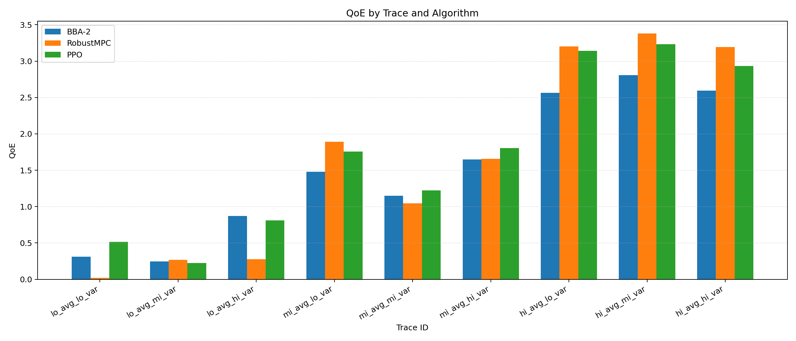
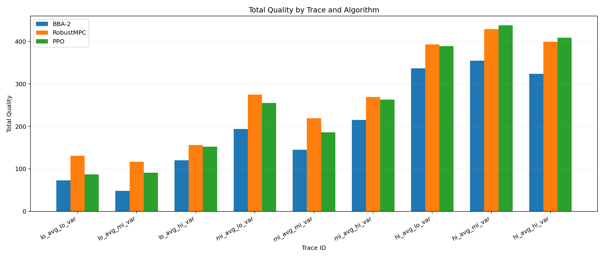
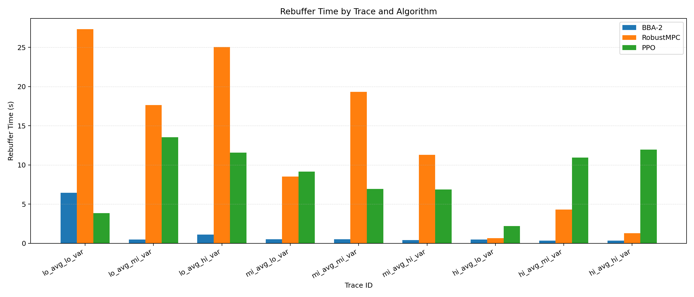
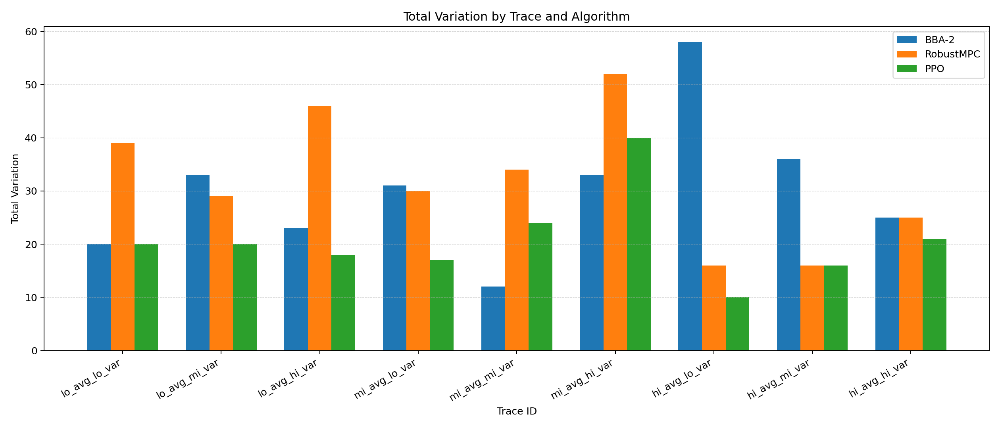

# Proximal Policy Optimization based Adaptive Bitrate Controller

A reinforcement learning based adaptive bitrate controller trained using Proximal Policy Optimization (PPO). 

This project explores applying policy-gradient methods to adaptive video streaming.

## Overview 

Adaptive bitrate (ABR) algorithms determine which bitrate a video
client should request for the next segment based on network conditions.

Traditional ABR approaches use heuristics or MPC. This project
instead trains a reinforcement learning policy using PPO to
maximize QoE metrics.

## Results
The PPO-ABR algorithm implemented was compared to personal implementations of two other algorithms: RobustMPC and BBA.
The BBA algorithm implemented did not use dynamic reservoir management. The startup phase was also simplified.

## Repository Structure

This repository includes:
- PPO policy implementation
- neural network architecture for ABR decisions
- training pipeline
- ABR controller logic

But does not include:
- Simulator
- Tester

These must be obtained separately, as they were provided as part of a university networking course and are private.

## Useful Resources
My prerequisite knowledge to this project included basic RL understanding from a graduate-level Artificial Intelligence course. Below are the resources I used to learn how to implement PPO. 

- [Eric Yangyu - PPO for Beginners](https://github.com/ericyangyu/PPO-for-Beginners)
- [OpenAI's RL Intro](https://spinningup.openai.com/en/latest/spinningup/rl_intro.html) (all 3 parts)
- [GAE Implementation](https://nn.labml.ai/rl/ppo/gae.html)

## License
This project is under the MIT license. See `License`.
